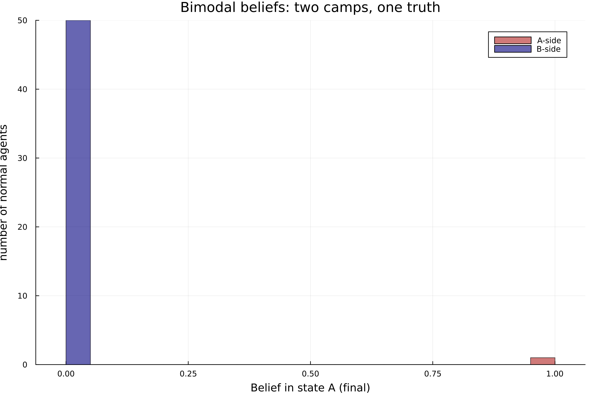

# Polarization and Trauma — Draft Model Setup (v2)

## Abstract

Bowen, Dmitriev, and Galperti (2023, henceforth BDG) show that sharing *verifiable* news can deepen polarization: a Bayesian listener who misperceives how selectively her contacts pass signals along can grow confident in the wrong state even as information becomes abundant. Their mechanism holds two objects fixed — the intensity of selective sharing and the social network. This paper makes both endogenous. A trauma-driven **urge** to over-share triggering news evolves over time, responding to the *share* of triggering content in one's own diet (a non-stationary selection intensity), and homophily lets the network thicken precisely when that urge flares. The two forces are complements: together they bend the community-wide urge map into an S-shape, producing a **flare-up equilibrium** alongside a **healing** one at identical primitives. Which a community reaches is selected by its history. Two communities with the same information quality and the same fundamentals can therefore diverge permanently. This is polarization with no change in fundamentals, which the fixed-selection benchmark cannot generate.

## 1. Introduction

BDG's puzzle is that abundant, truthful information need not bring agreement. Because friends choose *which* received signals to pass on but cannot fabricate them, a listener's diet is selected; if she underestimates that selection she reads a skewed diet as honest evidence and can converge to the wrong state. The force is strongest when her contacts are *dogmatic* — eager to share signals that favor one state and to suppress the other. BDG deliver this with a **fixed** selection intensity and a **fixed** network.

This paper relaxes exactly the two objects BDG hold fixed — the two extensions their own paper flags as open:

1. **Time-varying selection intensity (§5).** BDG's perceived selection $\hat\gamma$ is fixed, and their §III.D admits their "results may not be robust to agents learning the true $\gamma$." Here the *true* selection moves over time, driven by what a community has recently been exposed to. The listener faces a genuinely non-stationary environment — outside BDG's i.i.d.-across-time framework.
2. **Endogenous network formation through homophily (§4).** BDG fix the network and their conclusion lists endogenous homophily as future work, citing Golub–Jackson (2012), Baccara–Yariv (2013), and Halberstam–Knight (2016). Here same-type links thicken endogenously, and they thicken precisely when the community's urge flares.

The result is a **flare-up equilibrium**. Modeling the urge as a population-level law of motion, the two extensions interact: reactivity and network sorting are complements, and together they make the community-wide urge map admit *more than one* stable steady state — a low-urge **healing** rest point and a high-urge **flare-up** rest point — at one and the same set of primitives. The healing community's listener learns the truth; the flare-up community's listener locks onto the wrong state. Which basin a community lands in is fixed by its **history** (its initial urge), not by its fundamentals. So two communities identical in every primitive (same information quality $q$, same parameters) can diverge permanently. This is what a fixed-selection model cannot produce: there the learning threshold is a primitive and enough information eventually repairs learning for everyone; here the threshold is selected jointly with the trauma equilibrium, so a community trapped in the flare-up basin stays polarized at an information quality that would suffice under healing.

**Roadmap.** Section 2 fixes the environment, which is shared with BDG. The model then has two interacting blocks. The **belief block** (§6) takes a single listener with a *fixed* news diet and asks when Bayesian updating converges to the truth: it collapses an infinite sequence of updates to the sign of a scalar per-period drift $f(\omega;\alpha)$ (§6), writes that drift in primitives (§6.1), and signs how its long-run threshold $q_{LR}$ moves with the sharing urge $\alpha$ (§6.2). The **urge block** (§7), the contribution, lets $\alpha$ itself evolve: the three channels of §§3–5 (sharing biased by trauma, endogenous homophily, time-varying selection) feed a community-wide law of motion whose steady state can be multiple. Section 8 then composes the two blocks. Because the coupled system is *triangular*, one settles the urge and reads the belief off it, which gives the history-selected-polarization result; §9 concludes. (The belief block is presented before the contribution because §7 uses its two outputs; §7 opens with a compact statement of exactly what it borrows, so it can be read on its own.)

## 2. Setup
The basic set up is similar to the BDG paper 

**State of the world.** Two possibilities, fixed at $t=0$: $\omega \in \{A, B\}$, with shared prior belief $\pi = \Pr(\omega = A)$. 

**People.** A population $i \in \{1,\dots,N\}$ 

**Trauma type.** Each person has a trauma indicator $\tau_i \in \{0, A, B\}$, set once at $t=0$ . To make this baseline model simple, this indicator is**unrelated to $\omega$** . $\tau_i = 0$: no trauma. $\tau_i = A$: trauma that gets triggered by news *supporting* state $A$. $\tau_i = B$: trauma that gets triggered by news *supporting* state $B$. Let $\theta_A, \theta_B$ be the population shares; $\theta_0 = 1 - \theta_A - \theta_B$.

**Signals.** Same as BDG. Each period $t$, with probability $\gamma$, person $i$ gets a piece of firsthand news $s_{it} \in \{a, b\}$, where
$$\Pr(s_{it}=a \mid \omega=A) = \Pr(s_{it}=b \mid \omega=B) = q \in (\tfrac12, 1).$$
 Signals are independent across people and over time. **News cannot be fabricated**,  people choose whether to pass news on, but cannot make it up.

## 3. Channel 1 — Probabilistic sharing biased by trauma

When person $i$ holds a signal, she shares it with each friend with the following probabilities. Let $\sigma \in [0,1)$ be the baseline share rate and let $\alpha_{it}^A, \alpha_{it}^B \in [0, 1-\sigma]$ be person $i$'s extra urges to share $a$- and $b$-news. Only $A$-trauma carriers have $\alpha^A > 0$; only $B$-trauma carriers have $\alpha^B > 0$.

|              | shares $a$               | shares $b$               |
| ------------ | ------------------------ | ------------------------ |
| $\tau_i = 0$ | $\sigma$                 | $\sigma$                 |
| $\tau_i = A$ | $\sigma + \alpha_{it}^A$ | $\sigma$                 |
| $\tau_i = B$ | $\sigma$                 | $\sigma + \alpha_{it}^B$ |

The constraint $\sigma + \alpha^{\tau} \le 1$ keeps these as valid probabilities.

**This channel by itself adds nothing relative to BDG.** BDG's dogmatic friend hides the *opposing* signal with probability 1; my trauma friend over-shares the *triggering* signal with probability $\alpha^\tau$. I keep this parameterization because it lets $\alpha^\tau$ be a continuous primitive on which the time dynamics of §5 can act. 

## 4. Channel 2 — Endogenous network from homophily

BDG fixes the network. Their conclusion explicitly cites Golub and Jackson (2012), Baccara and Yariv (2013), Halberstam and Knight (2016) as the homophily literature that future work should engage. 

**Setup.** Each pair $(i,j)$ is connected with probability $p(\tau_i,\tau_j;\bar\alpha_t)$. The flare-driven part acts only **within a partisan type**, through a *bounded, sigmoidal (S -shaped)* (tipping) form:
$$p(\tau_i,\tau_j;\bar\alpha_t)=\rho_0+(1-\rho_0)\,\mathbf 1\{\tau_i=\tau_j\in\{A,B\}\}\,\ell(\bar\alpha_t^{\tau_i}),\qquad \ell(\alpha)=\frac{1}{1+e^{-\kappa(\alpha-\alpha_0)}},$$
This is the evolution of probability of connection throughout time. Where $\bar\alpha_t^{\tau}$ is the average urge among type-$\tau$ carriers, $\rho_0$ is the floor. Thus, all types connect with at least probability $\rho_0$, and they connect with different probabilities based on whether they share the same type. How much higher they connect with the same type would then depend on $l(\alpha)$. 
To understand the sigmoidal function, $\alpha$ is the urge to share the news and $\kappa$ is a social multiplier. $\alpha_0$ is the **tipping urge** (inflection point in the curve). Note that $\alpha_0$ is a fixed primitive, not an urge state. $\kappa\ge0$, and it is the **sorting steepness**, it governs how sharply connection responds to activation near the inflection point in the curve. It is the strength of the homophily (people connect to similar people) and complementarity (people connect to different people). the flare-up equilibrium exists only when $\kappa$ is large enough. 
This entire function is the reduced form of a logit discrete-choice sorting model. We set up our function such that it cannot be higher than $1$, it follows the law of diminishing marginal return and having a single inflection point. We want to make sure we only have one inflection point to make the story simple. 

To understand the function above: 

- *Sparse when calm, dense when flared.* At $\bar\alpha\approx0$ the within-type link probability is just above the floor ($\ell(0)=1/(1+e^{\kappa\alpha_0})$ small); as the community activates, $\ell\to1$ and same-type linking saturates near certainty. Baseline homophily is the floor $\ell(0)$; a flat network ($\kappa$ small, or $\alpha_0$ large) is the static-homophily benchmark BDG took as given.

- *Why not the linear form $\rho_0+h+\kappa\bar\alpha$?*  linear form cannot generate multiplicity at any sorting strength. Bistability requires the steady-state map $\Phi$ to develop a convex shoulder steep enough to become tangent to the 45° line, and that demands curvature concentrated near a threshold.  Through  numerical simulation, we find linear function admits a unique stable equilibrium for all $(\lambda, \kappa)$. In contrast, we have two possible equilibrium with the sigmoid.

**Where the thickening acts.** The $\kappa$ term carries the indicator $\mathbf 1\{\tau_i=\tau_j\}$, so it raises only *within-type* (partisan–partisan) link probability. The agent whose belief I track is a **normal** carrier ($\tau=0$); for any of her links to a partisan ($\tau_i=0\neq\tau_j$) both indicators vanish and $p=\rho_0$, independent of $\bar\alpha$. So **the listener's own friend counts $(n_A,n_B,n_0)$ are held fixed by construction** , and a flare hands her no new type-$A$ friends. What thickens is the network *one step out* (friends of friends): among her type-$A$ friends and *their* type-$A$ peers, raising those partisans' own exposure and hence their urge $\alpha$, which reaches her through the links she already has — each existing type-$A$ friend now over-shares more. The network feedback thus runs through the **intensive** margin (her friends' $\alpha$ rises), never the **extensive** one (her $n_A$ is fixed). §7 returns to why this distinction is what lets the belief effect be attributed cleanly to the new $\alpha-\hat\alpha$ channel rather than to BDG's friend-imbalance comparative statics (their Prop. 4–5).

We define healing and flare as the steady state of news sharing urge of the community. In the healing equilibrium, people over share triggering news only mildly, the same type network stays sparse, and a listener's diet stays close to honest. In a flare network, the high urge attractor $\bar\alpha^{\text{hi}}$ over share triggering news intensely, the same type network thickens into an echo chamber, and the diet skews toward the triggering signal.

## 5. Channel 3 — Time-varying selection intensity

BDG holds the selection parameter $\gamma$ fixed and assumes the listener's misperception $\hat\gamma$ is also fixed. Their §III.D explicitly notes their results "may not be robust to agents learning the true $\gamma$." A model where the true selection moves over time, in response to what the listener has been exposed to, is therefore outside BDG's framework.

**Law of motion.** The trauma type $\tau_i$ is fixed, but the active urge $\alpha_{it}^{\tau_i}$ adjusts each period toward a target set by recent triggering exposure. The target responds to the **proportion** of incoming news that is triggering, not to its absolute count. Empirical literature shows that the size of the network matters less for polarization, compared to the composition of the network.
Therefore, we have:
$$\alpha_{i,t+1}^{\tau_i} \;=\; (1-\delta)\,\alpha_{it}^{\tau_i} \;+\; \delta\,T\!\left(\phi_{it}^{\tau_i};\lambda\right),
\qquad T(\phi;\lambda)=(1-\sigma)\big(1-e^{-\lambda \phi}\big),\qquad
\phi_{it}^{\tau_i}:=\frac{m_{it}^{\tau_i}}{M_{it}}\in[0,1],$$
where:
Note that A signal is triggering for person $i$ if it matches her trauma type, I.e, an $a$ signal triggers an $A$ trauma carrier, a $b$ signal triggers a $B$ trauma carrier. A $\tau_i=0$ person has no triggering signal. When this paper mention triggering, it is discussing a relationship between a signal and a person. 
We keep $\alpha_{i,t+1}^{\tau_i}$ as a stochastic difference equation because near the tipping point, the process can wander around the unstable threshold by chance. And a single shock can flit the community from one equilibrium to another. 
- $\delta \in (0,1)$ is the **healing / adjustment speed**: each period the urge closes a fraction $\delta$ of the gap to its current target. Equivalently $\alpha$ is a geometrically-weighted memory of past triggering exposure with decay $1-\delta$.
- $\lambda \ge 0$ is **trigger sensitivity**: how sharply the *target* urge $T$ responds to the triggering share — the dose-response of the trauma channel. Because $\phi\in[0,1]$ is dimensionless, so is $\lambda$, and the dose-response no longer scales with the size of the network (§7).
- $m_{it}^{\tau_i}$ is the count of triggering signals received this period ($a$-signals if $\tau_i = A$; $b$-signals if $\tau_i = B$), and $M_{it}$ is the **total** count of signals received that period — triggering plus non-triggering, shared by friends plus her own. Their ratio $\phi_{it}^{\tau_i}$ is the triggering **share** of her period-$t$ diet (set $\phi=0$ when $M_{it}=0$). Note that as $n_A \to \infty$, signal she received herself become less relevant, 
- $T:[0,1]\to[0,(1-\sigma)(1-e^{-\lambda\phi})]$ is bounded and increasing, with $T(0)=0$ and $T(1)=(1-\sigma)(1-e^{-\lambda})$.

Because $\alpha_{i,t+1}$ is a **convex combination** of $\alpha_{it}\in[0,1-\sigma]$ and $T\in[0,1-\sigma]$, the interval $[0,1-\sigma]$ is invariant: once $\alpha$ is legal it stays legal. The probability budget $\sigma+\alpha\le 1$ holds automatically, with no clamp and no kink. The two parameters play distinct roles: $\lambda$ sets the *level* of activation a given exposure warrants; $\delta$ sets the *speed* of adjustment and the persistence of the wound. Neither subsumes the other.

**The listener.** The agent whose belief I track is a **normal** carrier ($\tau=0$, so $\alpha\equiv0$): she has no urge of her own and thus no law of motion on herself. She holds a **fixed** friend network $(n_A,n_B,n_0)$, both in counts and identities. She is Bayesian throughout but misspecified about her friends' urge $\alpha^\tau$: she uses a perceived $\hat\alpha_t^\tau \le \alpha_t^\tau$ to specify her friends’ urge. The simplest baseline takes$\hat\alpha_t^\tau = \hat\alpha$ constant : she treats selection as mild and stationary even as it grows large. This separation keep two processes cleanly apart. Partisans ($\tau\in\{A,B\}$) carry the *urge* loop, which is the §5 LOM driving $\bar\alpha$ and the *expressive* role of emitting selected signals. The listener carries the *belief* loop, which is Bayes’ rule driving$\mu$. The two couple only through the signals the partisans emit into her fixed diet; they never interact inside one agent's head.

## 6. The belief map: from Bayes to a per-period drift

This section is the **belief block**: take a single listener with a *fixed* news diet and ask when Bayesian updating converges to the truth. The network and the urge $\alpha$ are held **fixed** throughout; the moving-$\alpha$ case is exactly what breaks the i.i.d. argument below — and that break (handled in §7) is the contribution.

**One-period intuition first.** Before tracking beliefs over time, fix what a single friend's observation is worth. The listener knows each friend's type $\tau_j$ but underestimates the urge, using $\hat\alpha<\alpha$. For a trauma-$A$ friend in state $\omega$,
$$\Pr(\text{see } a \mid \omega, \tau_j = A) = \gamma \Pr(a\mid\omega)\,(\sigma+\alpha^A), \quad
\Pr(\text{see } b \mid \omega, \tau_j = A) = \gamma \Pr(b\mid\omega)\,\sigma,$$
with silence the complement (symmetric for trauma-$B$). The perceived likelihood ratios, which compares how probable an observation is under one hypothesis versus another are:
$$\hat L_j(a) = \frac{q}{1-q}, \qquad \hat L_j(b) = \frac{1-q}{q}, \qquad
\hat L_j(\varnothing \mid \tau_j = A) = \frac{1 - \gamma\sigma - \gamma q\,\hat\alpha^A}{1 - \gamma\sigma - \gamma(1-q)\,\hat\alpha^A}.$$
From this equation, we find: 
1. **An observed signal is worth $q/(1-q)$ regardless of sender.** The share-probability term $(\sigma + \alpha^\tau)$ cancels: once you *see* a signal, verifiability means only its informativeness $q$ matters. 
2. **Misperception enters only through silence.** A trauma-$A$ friend eager to share $a$ who instead stays silent is strong evidence against $A$; underestimating her urge ($\hat\alpha < \alpha$) keeps that silence ratio too close to $1$.

The rest of this section turns "the listener runs Bayes' rule every period forever" into a single scalar and check the sign.

**Odds form of Bayes' rule.** After the listener sees the period-$t$ profile of friend observations $o_t$, her posterior on $\omega=A$ is
$$\mu_{t+1}=\frac{\mu_t \Pr(o_t\mid A)}{\mu_t \Pr(o_t\mid A)+(1-\mu_t)\Pr(o_t\mid B)}.$$
Writing this in odds removes the normalizing denominator:
$$\underbrace{\frac{\mu{t+1}}{1-\mu{t+1}}}_{\text{posterior odds}}
=
\underbrace{\frac{\mu_t}{1-\mu_t}}_{\text{prior odds}}
\cdot
\underbrace{\frac{\Pr(o_t\mid A)}{\Pr(o_t\mid B)}}_{\text{likelihood ratio}}$$
**Factorize across friends.** Observations are independent across friends given $\omega$, so
$$\frac{\Pr(o_t \mid A)}{\Pr(o_t \mid B)} = \prod_{j} \rho_j(o_{j,t}),
\qquad
\rho_j(o_{j,t}) := \frac{\Pr(o_{j,t} \mid A)}{\Pr(o_{j,t} \mid B)}.$$
When the ratio is above $1$, the agents will have evidence *for* $A$.

**Go to log-odds.** Define the cumulative log-odds $\Lambda_t := \log\frac{\mu_t}{1-\mu_t}$ (recovered by $\mu_t = 1/(1+e^{-\Lambda_t})$). Taking logs turns the multiplicative update into an additive one, so belief evolution is literally a sum of per-period steps:
$$\Lambda_{t+1}=\Lambda_t+\Delta_t,\qquad \Delta_t := \sum_j \log\hat\rho_j(o_{j,t}),\qquad \Lambda_t=\Lambda_0+\sum_{\tau<t}\Delta_\tau,$$
with the prior as the starting point, $\Lambda_0=\log\frac{\pi}{1-\pi}$. So $\Lambda_t$ is the random walk; $\Delta_t$ is its step.

**Where misspecification enters.** The listener is misspecified: the weights $\log\hat\rho_j$ she applies come from her perceived model (with $\hat\alpha$), while the observations $o_{j,t}$ are drawn from the true model (with the real $\alpha$). Hence $\Delta_t=\sum_j \log\hat\rho_j(o_{j,t})$ where the $o_{j,t}$ obey the *true* probabilities. This mismatch — true data scored with wrong weights — is the entire source of incorrect learning.

**Per-observation weights.** Compute $\hat\rho_{(o)}$ for a generic friend whose sharing rule is "share a received $a$ with prob $\psi_a$, share a received $b$ with prob $\psi_b$" (these depend on type, never on $\omega$). A friend gets a signal with prob $\gamma$, and $\Pr(s=a\mid A)=q,\ \Pr(s=a\mid B)=1-q$.

From the listener’s side, what’s observable is “I saw an $a$come from $j$”, but that’s the combination of $j$ received signal $a$ and $j$ choose to share it. 
$$\Pr(\text{see }a\mid A)=\gamma\, q\,\psi_a,\qquad \Pr(\text{see }a\mid B)=\gamma\,(1-q)\,\psi_a,$$
$$\hat\rho(a)=\frac{\gamma q\psi_a}{\gamma(1-q)\psi_a}=\frac{q}{1-q}.$$
Similar to the single period result, both $\gamma$ and $\psi_a$ vanish. Once listener *see* a signal, the sender's eagerness to share ($\psi_a$, which carries $\alpha$ or $\hat\alpha$) is irrelevant — only the signal's informativeness $q$ matters. Define
$$L:=\log\frac{q}{1-q}>0,\qquad \log\hat\rho(a)=L,\qquad \log\hat\rho(b)=-L,$$
identically for every friend type.

Now we compute silence ratio in general form. When listener observe silence, nothing cancels, because the silence probability depends on the sharing rule. And this rule differs across states:
$$\Pr(\varnothing\mid A)=1-\gamma q\psi_a-\gamma(1-q)\psi_b,\qquad \Pr(\varnothing\mid B)=1-\gamma(1-q)\psi_a-\gamma q\psi_b.$$
Plugging in each type's *perceived* rule (the listener uses $\hat\alpha$):

- **Type A** ($\psi_a=\sigma+\hat\alpha,\ \psi_b=\sigma$; the $\gamma\sigma q$ cross-terms cancel):
$$s_A:=\log\hat\rho_{A}(\varnothing)=\log\frac{1-\gamma\sigma-\gamma q\,\hat\alpha}{1-\gamma\sigma-\gamma(1-q)\hat\alpha}<0.$$
A type-$A$ friend is eager to share $a$, so her silence is evidence *against* $A$ — hence $s_A<0$.
- **Type B** ($\psi_a=\sigma,\ \psi_b=\sigma+\hat\alpha$): by the $q\leftrightarrow 1-q$ swap, $\;s_B:=\log\hat\rho_{B}(\varnothing)=-s_A>0.$
- **Normal** ($\psi_a=\psi_b=\sigma$, per §3): $\Pr(\varnothing\mid A)=\Pr(\varnothing\mid B)=1-\gamma\sigma$, so $\log\hat\rho_n(\varnothing)=0$. A normal friend's silence carries no information — not because she always speaks, but because she shares $a$ and $b$ at the *same* rate $\sigma$, so silence is state-symmetric. 

**Assemble the step.** In a period the listener observes $\#a$ and $\#b$ — the total $a$- and $b$-signals shared by any friend, plus her own signal. She also observe $S_A,\,S_B$, the numbers of silent type-$A$ and type-$B$ friends. Summing the per-friend logs,
$$\boxed{\;\Delta_t = (\#a - \#b)\,L + S_A\,s_A + S_B\,s_B.\;}$$
Observed signals contribute $\pm L$ regardless of sender; only trauma-carrier silence carries the misperception. 

**From a walk to a sign check.** With $\alpha$ and the network fixed, signals are i.i.d. across periods, so the steps $\Delta_t$ are i.i.d. and $\Lambda_t$ is a random walk. According to the strong law of large number, Its fate is decided by the expected step under the *true* data-generating process. This expectation must be taken **conditional on each true state**, because the dangerous case is the truth running against the listener's trauma majority. Let
$$f(\omega):=\mathbb{E}_{\text{true}}[\Delta_t\mid\omega]= \\
\big(\mathbb{E}[\#a\mid\omega]-\mathbb{E}[\#b\mid\omega]\big)L+\mathbb{E}[S_A\mid\omega]\,s_A+\mathbb{E}[S_B\mid\omega]\,s_B.$$

Note that when listener has overwhelmingly more type A friends than type B friends, more A silence than B silence arrive, and $\mathbb E[S_a]-\mathbb E[S_b] > 0$. Under this scenario, the silence force is negative, and it pushes beliefs toward $B$. Under my numerical simulation, when $n_A = 1000$ and $n_B=1$, $f(A) <0$. When $n_A$ is not significant larger than $n_B$, for example $n_A = 16$ and $n_B =2$, $f(A)>0$ everywhere. 

Let the listener have $n_A$ type-$A$, $n_B$ type-$B$, and $n_0$ normal friends, plus her own firsthand signal. Her own signal is the *only* full-strength source (weight $1$); every friend passes the honest signal only at the baseline share rate $\sigma$ (§3). The expectations use the *true* $\alpha$. The expected net signals are
$$\mathbb{E}[\#a-\#b\mid\omega]= \\
\underbrace{\gamma\,d_\omega}_{\text{own signal}}+n_0\,\gamma\sigma\,d_\omega+ 
n_A\,\gamma\big[\sigma d_\omega+\textstyle\Pr(a\mid\omega)\alpha\big]+n_B\,\gamma\big[\sigma d_\omega-\Pr(b\mid\omega)\alpha\big],$$
so the honest (state-aligned) part collects to $\gamma d_\omega\big[1+\sigma(n_A{+}n_B{+}n_0)\big]$,
where $d_A:=2q-1>0$ and $d_B:=-(2q-1)$, $\Pr(a\mid A)=q$, $\Pr(a\mid B)=1-q$. The expected silence counts are
$$\mathbb{E}[S_A\mid\omega]=n_A\big(1-\gamma\sigma-\gamma\Pr(a\mid\omega)\,\alpha\big) , \\
\mathbb{E}[S_B\mid\omega]=n_B\big(1-\gamma\sigma-\gamma\Pr(b\mid\omega)\,\alpha\big) .$$
By the Strong Law of Large Numbers, $\Lambda_t/t \xrightarrow{\text{a.s.}} f(\omega)$, so
$$\begin{cases}
f(\omega) > 0: & \Lambda_t \to +\infty,\ \mu_t \to 1 \quad (\text{belief converges to } A), \\[4pt]
f(\omega) < 0: & \Lambda_t \to -\infty,\ \mu_t \to 0 \quad (\text{belief converges to } B).
\end{cases}$$
The prior $\Lambda_0$ is a finite head start swamped by the linear trend, so it washes out — consistent with BDG's Proposition 3.

**The threshold.** Take an $A$-leaning listener ($n_A>n_B$). Under $\omega=A$ the signal force and the silence force both point to $A$, so $f(A)>0$ for every $q$ when friends ratio are not extreme: she always learns a true $A$. The threshold is therefore pinned by the *opposite* state — $q_{LR}$ solves
$$f(\omega=B)=0.$$
For $q<q_{LR}$, $f(B)>0$: even when the truth is $B$, the misperceived silence of her many type-$A$ friends drives $\mu_t\to1$, i.e. confident in the wrong state. For $q>q_{LR}$, $f(B)<0$ and she learns the truth. (Evaluating $f$ only at $\omega=A$ never yields a finite threshold for an $A$-leaning network — that is the case where learning is always correct.) This $q_{LR}$ is BDG's threshold, now expressed through $(\sigma,\alpha,\hat\alpha)$ in place of their $(\gamma,\hat\gamma)$.

**Summary.** "Bayesian updating every period forever" has collapsed to the scalars $f(A),f(B)$ — expected log-odds steps — and a sign check. The rest of this block follows: §6.1 reads $f$ off as a function of $\alpha$, and §6.2 signs $dq_{LR}/d\alpha$. The contribution (§7) then handles the case the fixed-urge argument cannot: when $\alpha_t$ moves, $f=f(\alpha_t)$ is non-stationary, and the i.i.d.-SLLN argument is replaced with the steady-state-$\alpha$ analysis of the trauma loop.

### 6.1 The drift as a function of $\alpha$

§6 left the drift as

$$f(\omega)=
\underbrace{(\mathbb E[\#a-\#b\mid\omega]\big)L}_{\text{signal force}}
+\underbrace{\mathbb E[S_A\mid\omega]\,s_A+\mathbb E[S_B\mid\omega]\,s_B}_{\text{silence force}}$$
Writing the expectations out in primitives gives a form closed in everything except $q_{LR}$. It is cleanest to read $f$ as **three** pieces: the signal force itself splits into a *baseline* part (undistorted relaying of true signals) and an *over-sharing* part (the trauma skew), and the silence force is the third. 

Throughout, the listener has $n_A$ type-$A$, $n_B$ type-$B$, $n_0$ normal friends; her own firsthand signal is the only full-strength ($\psi=1$) source, every friends relay the honest signal at the baseline rate $\sigma$ (§3). The data are generated at the true urge $\alpha$, the weights use the perceived $\hat\alpha$. Recall $L=\log\frac{q}{1-q}>0$ and
$$s_A=\log\frac{1-\gamma\sigma-\gamma q\,\hat\alpha}{1-\gamma\sigma-\gamma(1-q)\hat\alpha}<0,\qquad s_B=-s_A,$$
so the silence force collapses to $s_A\big(\mathbb E[S_A\mid\omega]-\mathbb E[S_B\mid\omega]\big)$.

**Signal force** (expected net $a$'s, true $\alpha$):
$$E[\#a - \#b \mid A] = \underbrace{\gamma(2q-1)[1 + \sigma(n_A + n_B + n_0)]}_{\text{baseline}} + \underbrace{\gamma\alpha[qn_A - (1-q)n_B]}_{\text{over sharing}}$$
$$\mathbb E[\#a-\#b\mid B]=-\gamma(2q-1)\big[1+\sigma(n_A{+}n_B{+}n_0)\big]+\gamma\alpha\big[(1-q)n_A-q\,n_B\big].$$
The first term is the baseline signal: positive under $A$, negative under $B$, magnitude $\propto(2q-1)$. Its bracket term is the weight combining own signal and friends signal. The second is trauma over-sharing: type-$A$ friends inject extra $a$'s at rate $\propto\alpha$, type-$B$ friends extra $b$'s. Its weights swap $q\leftrightarrow 1-q$ rather than simply flipping sign with $\omega$, which is why an active $A$-community can tilt the signal balance toward $A$ even when the truth is $B$.

**Silence force** 
This is the only force carrying the misperception:
$\Pr(a\mid A)=q=\Pr(b\mid B)$ $\Pr(a\mid B)=1-q=\Pr(b\mid A)$
The counts were generated with true $\alpha$
$$\mathbb E[S_A\mid\omega]=n_A\big(1-\gamma\sigma-\gamma\Pr(a\mid\omega)\alpha\big),\qquad$$
$$\mathbb E[S_B\mid\omega]=n_B\big(1-\gamma\sigma-\gamma\Pr(b\mid\omega)\alpha\big).$$

**Threshold.** For an $A$-leaning listener ($n_A>n_B$) the binding case is $\omega=B$, and $q_{LR}(\alpha)$ is the $q\in(\tfrac12,1)$ solving
$$f(B;\alpha)=\Big(\mathbb E[\#a-\#b\mid B]\Big)L+s_A\Big(\mathbb E[S_A\mid B]-\mathbb E[S_B\mid B]\Big)=0.$$
This is transcendental in $q$ (both $L$ and $s_A$ depend on $q$), so $q_{LR}(\alpha)$ has no elementary closed form; it is defined implicitly and computed numerically.

**BDG nesting check.** Set $\sigma=0$ and true $\alpha=1$: a trauma-$A$ friend then shares $a$ iff she received one — exactly BDG's $A$-dogmatic friend — so the true model is their dogmatic network with $d_A=n_A,\ d_B=n_B$. The listener's misperception lives in $\hat\alpha<1$, and since (at $\sigma=0$)
$$s_A=\log\frac{1-\gamma q\,\hat\alpha}{1-\gamma(1-q)\hat\alpha},$$
$\hat\alpha$ enters multiplicatively with $\gamma$ exactly as BDG's $\hat\gamma$ does. Under the identification $\hat\gamma=\gamma\hat\alpha\,(<\gamma)$ the weight equals BDG's $\ln\hat\Gamma$, and $f(B;1)=0$ reproduces their threshold equation. So our $\hat\alpha<\alpha$ channel is observationally a BDG misperception with $\hat\gamma=\gamma\hat\alpha$ — the "misperceiving how dogmatic friends share" variant BDG flag in §VII — and this is the $(\sigma,\alpha,\hat\alpha)$-generalization of BDG eq. (2) / Appendix A.3, their fixed gap $\gamma-\hat\gamma$ replaced by the trauma gap $\alpha-\hat\alpha$.

### 6.2 The threshold rises with the urge

We have established the fact that the long run threshold is $q_LR(\alpha)$. Thus we need the sign of $dq_{LR}/d\alpha$ to understand how different urge of sharing lead to different outcomes. The urge enters both forces linearly, and $s_A$ does not depend on $\alpha$ (it uses $\hat\alpha$), so 
$$\frac{\partial f(B;\alpha)}{\partial\alpha}=\gamma\big[(1-q)n_A-q\,n_B\big]\,L+s_A\cdot(-\gamma)\big[(1-q)n_A-q\,n_B\big]=\gamma\big[(1-q)n_A-q\,n_B\big](L-s_A).$$
Since $s_A<0$, $L-s_A=L+|s_A|>0$, hence
$$\operatorname{sign}\frac{\partial f(B;\alpha)}{\partial\alpha}=\operatorname{sign}\big[(1-q)n_A-q\,n_B\big],$$
which is **positive** whenever $(1-q)n_A>q\,n_B$ . Thus, the network is $A$leaning enough relative to information quality, and it holds for all $q$ up to $n_A/(n_A+n_B)$. Under this condition a larger true urge pushes the drift toward $A$, the wrong state.

At the threshold $f(B;\cdot)$ crosses zero from $+$ (below $q_{LR}$, incorrect learning) to $-$ (above, correct learning), so $\partial f/\partial q<0$ there. By the implicit function theorem,
$$\frac{dq_{LR}}{d\alpha}=-\frac{\partial f/\partial\alpha}{\partial f/\partial q}>0.$$

So **$q_{LR}$ is increasing in the true urge $\alpha$** . This is exactly the link §7 invokes: a community at the flare-up equilibrium $\bar\alpha^{\mathrm{hi}}$ faces a higher $q_{LR}(\bar\alpha^{\mathrm{hi}})$ than one at the healing equilibrium $\bar\alpha^{\mathrm{lo}}$, so the same information quality $q$ can be sufficient for correct learning in the latter yet insufficient in the former — polarization with identical fundamentals.

## 7. The flare-up equilibrium and calibration

 "Healing" and "flare-up" are just the two stable resting points of the community-wide urge $\bar\alpha$ — the average **eagerness to over-share triggering news** among trauma carriers. At the **healing** equilibrium the urge $\bar\alpha^{\mathrm{lo}}$ is low: people share triggering and non-triggering news at roughly the same baseline rate, the same-type network stays sparse, and a listener's diet is close to honest, so she learns the truth. At the **flare-up** equilibrium $\bar\alpha^{\mathrm{hi}}$ the urge is high: carriers over-share triggering news, the same-type network thickens (more such friends, each louder), the diet skews toward the triggering signal, and a listener reads that skew as evidence and locks onto the wrong state. The point of this section is that *both* rest points can coexist at identical primitives with same $q$ and same $\lambda,\kappa$. so which one a community lands in is decided by its **history** (its starting urge $\bar\alpha_0$), not by its fundamentals. That history selected divergence is the polarization result; "trauma" is just the label for a high urge, self reinforcing diet.

Recall that With a *fixed* urge $\alpha$ and a fixed network, belief learning collapses to the sign of a scalar drift $f(\omega;\alpha)$ (§6). Also, the long run threshold $q_{LR}(\alpha)$ is *increasing* in the true urge ($\partial q_{LR}/\partial\alpha>0$, §6.2): a higher urge, against the listener's fixed $\hat\alpha$, makes correct learning harder. Everything here is about how the urge $\bar\alpha$ it is determined, and why it can settle at more than one value. The information quality $q$ then supports either correct learning or entrenched polarization, depending on which steady state a community settles in. The engine is a *complementarity* between reactivity $\lambda$ and the network-sorting feedback $\kappa$: neither produces multiplicity alone, but together they bend the steady-state map above the 45° line.

We want to collapse the community of $N\theta_A$ type$A$ carriers into a representative agent. We replaces carriers with different urge $\alpha_{it}$ into a representative agent carrying one common urge $\bar{\alpha}_t$. 

A natural first cut feeds the *absolute count* of triggering signals $\bar m(\bar\alpha)$ into the dose-response $T$. That works, but that means the community's **size** $N\theta_A$ scale the flare-up condition. We want polarization tracks the *composition* of networks, not their raw scale.

Through the numerical simulation using absolute count, we find with $\kappa=0$ (network formation is completely unresponsive to their emotional state), the map is globally concave with a unique steady state that rises in $\lambda$ but never tips, so **reactivity alone cannot create a flare-up**. However, we also find the count benchmark reaches bistability at much weaker sorting ($\kappa\approx12$) and over a much wider $\lambda$-band than the size-free share model below, which needs much stronger sorting, $\kappa=80$, and yields a narrow $\sim12\%$ band. However, even with a narrower band, our calibrated $\lambda$ sits inside the band, our result holds. Therefore, we drive the target with the **size-free triggering share** $\phi$, exactly as in the §5, and show the entire flare-up architecture survives with the size dependence removed.

Now we can identify the news diet of a type A representative agent with common urge $\bar\alpha$.  Her per-period expected inflows of triggering ($a$-) and non-triggering ($b$-) signals (counts) are: 
$$\bar m_a(\bar\alpha)=r_a\big[(\sigma+\bar\alpha)\,D_A(\bar\alpha)+\sigma D_o+1\big],\qquad
\bar m_b(\bar\alpha)=r_b\big[\sigma\,D_A(\bar\alpha)+\sigma D_o+1\big]$$
where $r_a:=\gamma\Pr(a\mid\omega)$ and $r_b:=\gamma\Pr(b\mid\omega)$ (so $r_a+r_b=\gamma$). 

The expected number of same type friends a representative carries is $D_A(\bar\alpha)=(N\theta_A-1)\,d(\bar\alpha)$  , with $d(\bar\alpha)=\rho_0+(1-\rho_0)\ell(\bar\alpha)$ , and $\ell(\bar\alpha)=1/\big(1+e^{-\kappa(\bar\alpha-\alpha_0)}\big)$ $D_o=N(1-\theta_A)\rho_0$ is her count of non same type friends. In this model, only same type friends carry the over share $\bar\alpha$, and they carry them only into the $a$ channel. At the mean time, the $b$ channel sees every friend at the baseline $\sigma$ since type $B$ friends' own over-sharing of $b$ is independent of the type $A$ urge $\bar\alpha$ and merely inflates the $b$ baseline.

The urge now responds to the triggering **share** of the diet,
$$\phi(\bar\alpha):=\frac{\bar m_a(\bar\alpha)}{\bar m_a(\bar\alpha)+\bar m_b(\bar\alpha)}\in[0,1].$$

Now we try to solve the scale invariance point. We scale $N\theta_A$, $D_A$ and $D_o$ by a common factor, leaves the own-signal $+1$ behind and multiplies both $\bar m_a$ and $\bar m_b$ by that factor. As the network grows the $+1$ is negligible and $\phi$ depends only on the **composition ratio**
$$\beta:=\frac{D_o}{N\theta_A-1}\approx\frac{(1-\theta_A)\,\rho_0}{\theta_A},$$
Dropping the $+1$ and dividing through by $(N\theta_A-1)$, we have: 
$$\phi(\bar\alpha)=\frac{r_a\,u(\bar\alpha)}{r_a\,u(\bar\alpha)+r_b\,v(\bar\alpha)},\qquad
u(\bar\alpha):=(\sigma+\bar\alpha)\,d(\bar\alpha)+\sigma\beta,\quad
v(\bar\alpha):=\sigma\big(d(\bar\alpha)+\beta\big),$$
with $d(\bar\alpha)=\rho_0+(1-\rho_0)\ell(\bar\alpha)$ (the §4 sigmoid link probability). The own first hand signal is the *only* finite-$N$ correction; it pulls triggering share $\phi$ toward the carrier's own unbiased frequency $\Pr(a\mid\omega)$ and vanishes as $N\to\infty$. 

At $\bar\alpha=0$ there is no over-sharing, so $u(0)=v(0)=\sigma\big(d(0)+\beta\big)$ and
$$\phi(0)=\frac{r_a}{r_a+r_b}=\Pr(a\mid\omega).$$

We call this community as “calm community”. A calm community's diet just mirrors the true signal frequencies: $\phi(0)=q$ under $\omega=A$ and $\phi(0)=1-q$ under $\omega=B$. From there $\phi$ rises in $\bar\alpha$, the over share term $(\sigma+\bar\alpha)$ tilts the diet toward the triggering signal and is bounded above, climbing toward a ceiling near $1$. It is size free: only the composition ratio $\beta$ enters, never $N\theta_A$.

We run numerical simulation at the calm community as a baseline. With the calibrated $(\kappa,\alpha_0)=(80,0.55)$ the sigmoid's inflection sits at $\bar\alpha=\alpha_0=0.55$, so $\ell(0),\ell'(0),\ell''(0)$ are all negligible ($\ell(0)\approx10^{-19}$) and a Taylor expansion at $\bar\alpha=0$ sees no curvature. At the calm baseline the share is weakly concave. The convex segment therefore lives **near $\alpha_0$**, where the same-type degree $d(\bar\alpha)$ swings from its floor $\rho_0$ up toward $1$. The location of the equilibrium and the stability margin only has numerical solution. This is the price of the bounded form, we find the increasing returns concentrate near the tipping urge instead of admitting a clean origin expansion.

To compute the curvature of the full map, we use the following Lemma:  
$\Phi(\bar\alpha)=T(\phi(\bar\alpha);\lambda)=(1-\sigma)\big(1-e^{-\lambda\phi(\bar\alpha)}\big)$
$$\Phi'(\bar\alpha)=(1-\sigma)\lambda e^{-\lambda\phi}\,\phi',\qquad
\Phi''(\bar\alpha)=(1-\sigma)\lambda e^{-\lambda\phi}\big[\phi''-\lambda(\phi')^2\big]$$

Two forces shape $\Phi(\bar\alpha)$ as the urge rises. The triggering inflow $u(\bar\alpha)=(\sigma+\bar\alpha)\,d(\bar\alpha)+\sigma\beta$ contains the over-share term $\bar\alpha\,d(\bar\alpha)$ — a product of two factors that both rise with $\bar\alpha$, since a higher urge both raises each friend's over-sharing and thickens the same-type network (through $d$). The non-triggering inflow $v(\bar\alpha)=\sigma\big(d(\bar\alpha)+\beta\big)$ contains $d$ only once, at the fixed baseline rate $\sigma$. So as $\bar\alpha$ approaches the sigmoid's inflection, where $d$ swings up off its floor, $u$ grows faster than $v$ and the triggering share $\phi$ accelerates upward: $\phi''>0$ over a middle range.

This convexity is bounded. Because $\phi\in[0,1]$ has a ceiling near $1$, the acceleration cannot persist; once the network saturates, $\phi$ flattens and $\phi''$ turns negative. The curvature of the steady-state map $\Phi=T\circ\phi$ follows the bracket $\operatorname{sign}\Phi''=\operatorname{sign}\big[\phi''-\lambda(\phi')^2\big]$ (curvature lemma), which is positive over an interior range — where $\phi''>0$ is large enough to beat $\lambda(\phi')^2$ — and negative outside it. Hence $\Phi$ is convex-then-concave, $\Phi''$ flips sign exactly once, and $\Phi$ can cross the $45^\circ$ line three times: $\bar\alpha^{\mathrm{lo}}<\bar\alpha^{\mathrm{mid}}<\bar\alpha^{\mathrm{hi}}$, with the outer two stable ($\Phi'<1$) and the middle one unstable. The simulated map confirms exactly this three-crossing geometry at the calibration below.

{width=80%}

Under the bounded sigmoid link the sign flip and the crossings have no elementary closed form; they are located numerically. The three-crossing region is a $(\lambda,\kappa)$ band pinned by the fold locus $\Phi(\bar\alpha^\dagger)=\bar\alpha^\dagger,\ \Phi'(\bar\alpha^\dagger)=1$. The payoff of driving the urge with the size-free share $\phi$ rather than the raw count is that this locus no longer slides with community size $N\theta_A$.

Now we want to solve the steady state condition. A steady state urge solves $\bar\alpha=\Phi(\bar\alpha)$ on $[0,1-\sigma]$. $\Phi$ is continuous, increasing, and maps $[0,1-\sigma]$ into itself, so by Tarski's theorem the set of steady states is a nonempty complete lattice a least and a greatest one always exist.  The actual dynamic is $\alpha_{t+1}=\Psi(\alpha_t)$ with $\Psi(\alpha)=(1-\delta)\alpha+\delta\Phi(\alpha)$. Since $\Psi(\alpha)=\alpha\iff\Phi(\alpha)=\alpha$, the two maps share fixed points, and $\Psi'(\alpha)=(1-\delta)+\delta\Phi'(\alpha)<1\iff\Phi'(\alpha)<1$. So a steady state is stable iff $\Phi$ crosses the 45° line from above ($\Phi'<1$) and $\delta$ sets the speed of approach. 

 **Proposition (flare-up equilibrium).** The map $\Phi$ has three fixed points,  including a low-urge healing equilibrium and a high-urge flare-up equilibrium, separated by an unstable threshold. The band is bounded by the fold (saddle-node) locus, where $\Phi$ is tangent to the 45° line:
$$\Phi(\bar\alpha^\dagger)=\bar\alpha^\dagger \quad\text{and}\quad \Phi'(\bar\alpha^\dagger)=1 \quad\text{for some }\bar\alpha^\dagger\in(0,1-\sigma).$$
 Along this locus the critical reactivity is strictly decreasing in the sorting parameter: $d\lambda^\ast/d\kappa<0$. The inequality $d\lambda^\ast/d\kappa<0$ states precisely what “reactivity and the social loop strengthen each other” mean: a stronger network response $\kappa$ lowers the reactivity $\lambda$ needed to tip a community into a flare-up, and vice versa. 

The proposition characterizes the fold band for a given map $\Phi$. But $\Phi$ is not unique across states: the urge is fed by triggering ($a$-) signals, whose supply is $r_\omega=\gamma\Pr(a\mid\omega)$, and so inherits the state with $r_A=\gamma q>r_B=\gamma(1-q)$.  There are therefore two maps, $\Phi_A$ and $\Phi_B$: raising the  $r_\omega$ (supply of triggering signals), and with it the fold locus. Each state has its own fold band, and the history-selection result lives entirely in the $\omega=B$ band — so it is that band, not the abstract region of the proposition, that the result requires.  Because $\Phi$ is convex-then-concave (curvature lemma), the tangency condition has **two** roots $\bar\alpha^\dagger_{\mathrm{lo}}<\bar\alpha^\dagger_{\mathrm{hi}}$: a *lower fold* where the flare-up pair $(\bar\alpha^{\mathrm{mid}},\bar\alpha^{\mathrm{hi}})$ is born, and an *upper fold* where the healing pair $(\bar\alpha^{\mathrm{lo}},\bar\alpha^{\mathrm{mid}})$ dies. So for fixed $\kappa$ the system is **bistable only on a band** $\lambda\in(\lambda_{\mathrm{lo}}^\omega(\kappa),\lambda_{\mathrm{hi}}^\omega(\kappa))$: below it everyone heals (mono-low), above it everyone flares (mono-high). Raising the fuel $r_\omega$ slides the band to lower $\lambda$.

The divergence story requires the truth  $\omega=B$ to be bistable, and both edges bind for a reason. Below the band, the community always heals, so no flare-up basin exists and history has nothing to select between. Above it, every community flares regardless of history, so the outcome no longer depends on where it started. The story“divergence decided by the community’s initial urge” degenerates into "when reactivity is high enough, every community polarizes." Only inside the band do two basins coexist, and only then does initial history decide which a community reaches.

Note that flaring under $\omega = A$ is harmless: it drives belief toward A, a correct state. Since the triggering signal $a$ is more common under $\omega=A$ than under $\omega=B$, $r_A=\gamma q>r_B=\gamma(1-q)$.  Thus the fold band for $\omega=A$ sits at lower $\lambda$ than the band for $\omega=B$. Thus a $\lambda$ tuned to make $\omega=B$ bistable typically leaves the community past its upper fold. Under the bounded sigmoidal link of §4 the sign of $\Phi''$, and with it the fold band, has no elementary closed form; it is computed numerically.

The numerically computed regime map makes the bistable band and its state-dependence visible, and locates the calibration inside it.

{width=80%}

**Calibration and the divergence result.** The rejected linear link $\rho_0+h+\kappa\bar\alpha$ would have its *slope* capped near $1$ and leave no bistable band at all. The bounded sigmoid link instead lets the sorting steepness $\kappa$ be large without breaching the probability budget: the within-type link probability saturates at $\le1$ , so no clamp is needed however steep the sorting. This is what makes a bistable band attainable under the size-free share $\phi$, whose compressed range — its floor is $\phi(0)=1-q=0.30$ under $\omega=B$ — would otherwise leave no room for multiplicity. At $(\kappa=80,\alpha_0=0.55)$ the $\omega=B$ band is $\lambda\in(1.285,1.443)$ (relative width $\sim12\%$), and the centered choice $\lambda=1.364$ sits inside it. There the healing and flare-up urges are $\bar\alpha^{\mathrm{lo}}\approx0.446$ and $\bar\alpha^{\mathrm{hi}}\approx0.568$ under $\omega=B$ (unstable threshold $\bar\alpha^{\mathrm{mid}}\approx0.506$), while under $\omega=A$ the community is at a single high-urge equilibrium (harmless). Fed into the §6.1 drift with a fixed listener network $(n_A,n_B,n_0)=(16,2,3)$ and $\hat\alpha=0.05$, these give $f(B;\bar\alpha^{\mathrm{lo}})<0<f(B;\bar\alpha^{\mathrm{hi}})$: the healing community learns the truth and the flare-up community converges to the wrong state, at one and the same $q=0.70$. In the stochastic replication the two basins separate cleanly, $\mu_T\approx0.01$ (healing, correct) versus $\mu_T\approx0.98$ (flare, wrong) — each a mean over $R=10{,}000$ independent listeners under truth $\omega=B$, with Monte Carlo standard error $\sqrt{p(1-p)/R}\lesssim0.002$, so the basins lie hundreds of standard errors apart.

{width=85%}

So two communities with identical primitives $(q,\gamma,\sigma,\lambda,\delta,\kappa,\hat\alpha)$ can diverge permanently. This is what BDG cannot generate: there $q_{LR}$ is a fixed object and raising $q$ eventually fixes learning; here $q_{LR}$ is selected jointly with the trauma equilibrium, so a community trapped in the flare up basin stays polarized even at information quality that would suffice under healing.

## 8. Solution of the full model

§7 characterizes the partisan **urge** steady state(s); §6 characterizes the listener's **belief** given a *fixed* urge. Solving the model means composing them: the long-run pair $(\bar\alpha^\ast,\mu_\infty)$ as a function of the primitives and of *history* (the initial urge $\bar\alpha_0$). Neither block has an elementary closed form — the urge fixed point and the threshold $q_{LR}$ are both transcendental — so the solution is characterized analytically and the two scalars are computed numerically. The qualitative prediction (who learns the truth, and when two identical communities diverge) is fully pinned down by signs.

**The system is triangular.** Write the mean-field state as $(\bar\alpha_t,\Lambda_t)$, the representative type-$A$ urge and the listener's cumulative log-odds. Its dynamics split:
$$\text{(urge)}\quad \bar\alpha_{t+1}=\Psi(\bar\alpha_t):=(1-\delta)\,\bar\alpha_t+\delta\,\Phi(\bar\alpha_t),\qquad \Phi(\bar\alpha)=(1-\sigma)\big(1-e^{-\lambda\phi(\bar\alpha)}\big),$$
$$\text{(belief)}\quad \Lambda_{t+1}=\Lambda_t+\Delta_t,\qquad \mathbb E[\Delta_t\mid\omega]=f(\omega;\bar\alpha_t),$$
with $\phi$ the §7 triggering share and $f$ the §6.1 drift (true urge $\bar\alpha_t$ in the data, fixed $\hat\alpha$ in the weights). The urge block is **autonomous**: the partisans who drive $\bar\alpha$ never observe the tracked listener, so $\Lambda$ does not enter $\Psi$ — the two loops couple only one-way, through the signals the partisans emit into her fixed diet (§5). The state-space map is therefore lower-triangular, and the solution is sequential: settle the urge, then read the belief off it.

### 8.1 Block 1 — the urge

Stable steady states are the fixed points of $\Phi$ with $\Phi'<1$ (the §7 stability test, inherited because $\Psi'(\bar\alpha)=(1-\delta)+\delta\Phi'(\bar\alpha)<1\iff\Phi'(\bar\alpha)<1$). By the §7 curvature lemma there are two regimes:

- **Mono regime** (outside the $(\lambda,\kappa)$ band): a unique stable $\bar\alpha^\ast$, reached from every $\bar\alpha_0$.
- **Bistable regime** (inside the band, which requires $\kappa$ large enough for the convex shoulder near $\alpha_0$ and $\lambda$ in the fold interval): two stable equilibria $\bar\alpha^{\mathrm{lo}}<\bar\alpha^{\mathrm{hi}}$ separated by the unstable threshold $\bar\alpha^{\mathrm{mid}}$.

There is no elementary closed form ($\Phi(\bar\alpha)=\bar\alpha$ is transcendental in $\bar\alpha$), so the equilibria are obtained by iterating $\Psi$ to convergence, or by root-finding $\Phi(\bar\alpha)-\bar\alpha=0$ (this is exactly the `basin()` routine of the replication). In the bistable regime **history selects the basin**:
$$\bar\alpha^\ast(\bar\alpha_0)=\begin{cases}\bar\alpha^{\mathrm{lo}}, & \bar\alpha_0<\bar\alpha^{\mathrm{mid}},\\[2pt]\bar\alpha^{\mathrm{hi}}, & \bar\alpha_0>\bar\alpha^{\mathrm{mid}},\end{cases}$$
and $\bar\alpha^\ast(\bar\alpha_0)\equiv\bar\alpha^\ast$ in the mono regime. Convergence to the selected fixed point is geometric, $|\bar\alpha_t-\bar\alpha^\ast|=O(\rho^t)$ with rate $\rho=\Psi'(\bar\alpha^\ast)=(1-\delta)+\delta\Phi'(\bar\alpha^\ast)\in(0,1)$; $\delta$ governs the speed but not the limit.

{width=80%}

### 8.2 Block 2 — the belief at the limiting urge

Given the selected limit $\bar\alpha^\ast$, the listener's belief solves a random walk with a *moving but converging* drift. The §6 argument assumed a fixed urge (i.i.d. steps); here $\bar\alpha_t$ is still in motion, so we need the non-stationary version. Write
$$\Lambda_t=\Lambda_0+\sum_{\tau<t}\Delta_\tau,\qquad \Delta_\tau=(\#a_\tau-\#b_\tau)L+S_{A,\tau}s_A+S_{B,\tau}s_B,$$
and establish the limit in five steps.

1. **Independence.** Signals are i.i.d. across periods given the urge path, so the steps $\{\Delta_\tau\}$ are independent. They are *not* identically distributed: $\bar\alpha_\tau$ changes the data-generating rates period by period.
2. **Bounded variance.** The listener's network $(n_A,n_B,n_0)$ is fixed and finite and the per-friend weights $L,s_A,s_B$ are finite constants (functions of $q,\gamma,\sigma,\hat\alpha$ only). Hence each $\Delta_\tau$ is a finite sum of bounded terms, $|\Delta_\tau|\le C$, so $\operatorname{Var}(\Delta_\tau)\le C^2$ uniformly in $\tau$.
3. **Means converge.** By Block 1, $\bar\alpha_\tau\to\bar\alpha^\ast$, and $f(\omega;\cdot)$ is continuous in the urge, so the conditional step mean converges:
$$\mathbb E[\Delta_\tau\mid\omega]=f(\omega;\bar\alpha_\tau)\ \longrightarrow\ f(\omega;\bar\alpha^\ast)=:f^\ast.$$
4. **Kolmogorov SLLN (independent, non-identical).** Bounded variance gives $\sum_{\tau\ge1}\operatorname{Var}(\Delta_\tau)/\tau^2\le C^2\sum_{\tau\ge1}\tau^{-2}<\infty$, which is Kolmogorov's criterion. Therefore the centered average vanishes almost surely:
$$\frac1t\sum_{\tau<t}\big(\Delta_\tau-f(\omega;\bar\alpha_\tau)\big)\ \xrightarrow{\text{a.s.}}\ 0.$$
5. **Cesàro.** Averages of a convergent sequence converge to its limit, so $\frac1t\sum_{\tau<t}f(\omega;\bar\alpha_\tau)\to f^\ast$; and the prior is a finite head start, $\Lambda_0/t\to0$. Adding the two,
$$\frac{\Lambda_t}{t}\ \xrightarrow{\text{a.s.}}\ f^\ast=f(\omega;\bar\alpha^\ast).$$

The walk therefore inherits the sign of the drift evaluated *at the limiting urge*, and the belief is degenerate:
$$\boxed{\ \mu_\infty(\omega)=\mathbf 1\{f(\omega;\bar\alpha^\ast)>0\}\quad\text{for a.e. }q.\ }$$
Equivalently, the listener learns the truth iff $q>q_{LR}(\bar\alpha^\ast)$, where $q_{LR}$ solves $f(B;\bar\alpha^\ast)=0$ (transcendental, computed numerically). The single non-degenerate case is the knife-edge $f^\ast=0$, i.e. $q=q_{LR}(\bar\alpha^\ast)$ exactly: there the walk is driftless and $\mu_t$ does not settle at $0$ or $1$ — a measure-zero event in $q$, ignored.

Two reductions confirm the step. (i) *Fixed urge.* If the community starts at its equilibrium, $\bar\alpha_t\equiv\bar\alpha^\ast$, the steps are i.i.d. and the argument collapses to the ordinary SLLN of §6 — the moving-urge limit is a strict generalization, not a different claim. (ii) *BDG.* Under the §6.1 nesting ($\sigma=0$, true $\alpha=1$, $\hat\gamma=\gamma\hat\alpha$) the drift $f$ is BDG's and the threshold reproduces theirs; the only new content is that $\bar\alpha^\ast$, hence $q_{LR}(\bar\alpha^\ast)$, is now *endogenous* to the trauma loop rather than a primitive.

Note that nothing in §6/§6.1/§6.2 changes: §7 altered only how $\bar\alpha^\ast$ is produced (the urge block), not the belief map $f(\cdot;\bar\alpha^\ast)$ that consumes it. The proportion reformulation lives entirely upstream of the listener.

### 8.3 The solution, and polarization without a change in fundamentals

Collecting the two blocks, the model's solution is the map
$$\big(\underbrace{q,\gamma,\sigma,\lambda,\delta,\kappa,\alpha_0,\rho_0,\theta_A,\hat\alpha,\,n_A,n_B,n_0}_{\text{primitives}};\ \underbrace{\bar\alpha_0}_{\text{history}}\big)\ \longmapsto\ \big(\bar\alpha^\ast,\ \mu_\infty\big),$$
computed in two moves: **(i)** iterate the urge map $\Psi$ from $\bar\alpha_0$ to its limit $\bar\alpha^\ast$; **(ii)** take the sign of $f(\omega;\bar\alpha^\ast)$. No closed form is needed at either step.

 **Corollary (history-selected polarization).** Suppose Block 1 is bistable under the binding state $\omega=B$ and information quality lies in the gap
$$q_{LR}(\bar\alpha^{\mathrm{lo}})\;<\;q\;<\;q_{LR}(\bar\alpha^{\mathrm{hi}}).$$
Then two communities identical in *every* primitive, differing only in history $\bar\alpha_0$ (one seeded below $\bar\alpha^{\mathrm{mid}}$, one above), converge to opposite long-run beliefs under the same truth $\omega=B$: the healing community ($\bar\alpha^{\mathrm{lo}}$) has $f(B;\bar\alpha^{\mathrm{lo}})<0$ and learns the truth, while the flare-up community ($\bar\alpha^{\mathrm{hi}}$) has $f(B;\bar\alpha^{\mathrm{hi}})>0$ and entrenches in the wrong state. Permanent polarization at identical fundamentals and identical $q$, selected purely by history.

{width=85%}

The gap is nonempty precisely because $q_{LR}$ is strictly increasing in the urge ($\partial q_{LR}/\partial\alpha>0$, §6.2) and the two stable urges are distinct ($\bar\alpha^{\mathrm{lo}}<\bar\alpha^{\mathrm{hi}}$, §7). This is the result BDG cannot produce: there $q_{LR}$ is a fixed primitive and raising $q$ eventually repairs learning for everyone; here $q_{LR}(\bar\alpha^\ast)$ is selected jointly with the trauma equilibrium, so a community trapped in the flare-up basin stays polarized at a $q$ that would suffice under healing.

The same divergence survives when the representative-agent mean field is replaced by an explicit wired population (`trauma_network_sim.jl`): partisans rewire their same-type subgraph each period as their urge flares, while each tracked normal keeps a fixed neighbor set. When both partisan camps sit in the flare basin the population splits into two camps that disagree under one truth; when the $A$-community instead heals, its normals learn the truth too — so the split is *contingent on history*, not on fundamentals.

{width=85%}

{width=85%}

{width=85%}

### 8.4 Computation

The replication's `trauma_phase_diagram.jl` already realizes this map under the §4 sigmoid link and the size-free triggering share: `basin()` performs move (i) — iterating $\Psi$ with $\phi=\bar m_a/(\bar m_a+\bar m_b)$ and the same-type degree $d(\bar\alpha)=\rho_0+(1-\rho_0)\ell(\bar\alpha)$ (its `psame`) — and `driftA()`+`finalmu()` perform move (ii); its two-basin phase plots are the solution map drawn over $(\bar\alpha_0,\text{structure})$. §7's prose has been brought in line with this code: it formerly carried a linear-degree shortcut $d=\eta+\kappa\bar\alpha$ for the network response, which §4 rejects and the code never used. The `basinCount` routine is retained only to draw the size-dependent count-model contrast. Because the size-free share only relocates the $(\lambda,\kappa)$ band rather than abolishing it, the bistability — and hence the divergence corollary — stands. Drawing the solution map over the primitives makes both halves of the result visible: polarization needs *both* a flare-basin history and an imbalanced listener, and community *size* drops out entirely.

{width=85%}

{width=85%}

## 9. Conclusion

This paper takes the two objects BDG hold fixed — the intensity of selective sharing and the network — and lets both move. A trauma-driven urge to over-share triggering news follows a population-level law of motion (§5), and homophily makes the same-type network thicken as that urge flares (§4). The two are complements: their interaction bends the community-wide urge map into an S-shape, so the urge can settle at either a low **healing** rest point or a high **flare-up** rest point at one and the same set of primitives (§7). Feeding each equilibrium urge into the belief map of §6 — where a higher *true* urge raises the learning threshold $q_{LR}$ against the listener's fixed $\hat\alpha$ — yields the result (§8): two communities identical in every primitive, differing only in *history*, converge to opposite long-run beliefs under the same truth. Polarization is selected by history, not by fundamentals — which the fixed-selection benchmark cannot produce, because there enough information eventually repairs learning for everyone.

